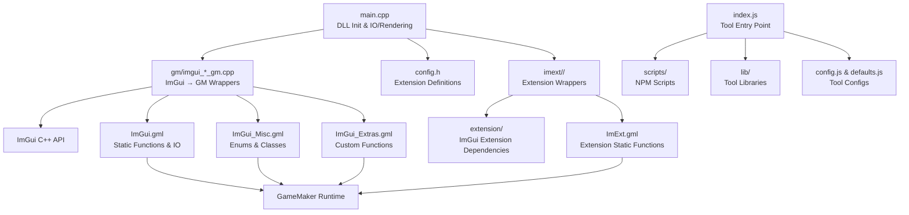

# ImGM Architecture Overview

This guide breaks down the components that power ImGM — from low-level DLL integration to high-level GameMaker scripting.

```mermaid
graph TD
    %% DLL Layer
    A[main.cpp<br>DLL Init & IO/Rendering] --> B[gm/imgui_*_gm.cpp<br>ImGui → GM Wrappers]
    B --> C[ImGui C++ API]
    A --> D[config.h<br>Extension Definitions]
    A --> E[imext/<ext_name>/<br>Extension Wrappers]
    E --> F[extension/<br>ImGui Extension Dependencies]

    %% Tooling Layer
    G[index.js<br>Tool Entry Point] --> H[scripts/<br>NPM Scripts]
    G --> I[lib/<br>Tool Libraries]
    G --> J[config.js & defaults.js<br>Tool Configs]

    %% GameMaker Layer
    B --> K[ImGui.gml<br>Static Functions & IO]
    B --> L[ImGui_Misc.gml<br>Enums & Classes]
    E --> M[ImExt<ExtensionName>.gml<br>Extension Static Functions]
    B --> N[ImGui_Extras.gml<br>Custom Functions]

    %% Runtime Flow
    K --> O[GameMaker Runtime]
    L --> O
    M --> O
    N --> O
```
