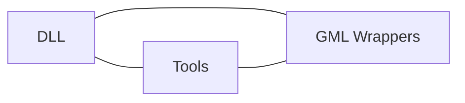

# Architecture

This document describes the architectural layers of **ImGM** and how they interact to provide a maintainable integration of ImGui into GameMaker.

---

## Overview

ImGM is designed around a layered architecture that separates responsibilities:

1. **DLL Integration**
   Provides the native bridge to ImGui’s C++ implementation.
   Handles low-level calls, memory management, and lifecycle.

2. **Tooling & Scripts**
   Automates tasks such wrappers generation, coverage reporting...
   Ensures maintaining consistency without manual overhead.

3. **GameMaker Bindings**
   Exposes ImGui functionality through GML wrappers.
   Organizes the created functions by namespace (ImGui, or an ImGui extension) for clarity and modularity.

---

## Layered Design

### DLL Integration
- The foundation of ImGM.
- Responsible for loading the ImGui DLL and exposing its functions.
- Provides lifecycle hooks (initialization, shutdown, frame updates).

### Tooling & Scripts
- A set of libraries and scripts, written in Javascript for NodeJS, to manage:
  - Generating Wrappers (`wrappers:gen`)
  - Updating dependencies (`modules:copy`)
  - Coverage reporting
  - Other automated tasks for easier consistency
- These tools ensure transparency and reproducibility in releases.

### GameMaker Bindings
- Asset folders and scripts in GameMaker.
- Wrappers translate GameMaker functions into ImGui calls.
- Mostly categorized by namespace (e.g. `ImGui`).

---

## Design Principles

- **Modularity**: Each layer is independent but connected through clear interfaces.
- **Transparency**: Coverage reports and changelogs document what is available and what has changed.
- **Future-Proofing**: Scripts and wrappers made simple to anticipate and easily work alongwith new ImGui features and GameMaker updates.
- **Contributor-Friendly**: Documentation and tooling to lower the barrier for contributions and future development.

---

## Example Flow

1. A developer calls `ImGui.Button("Click Me")` in GameMaker.
2. The wrapper forwards the call to the DLL integration layer.
3. The DLL executes the ImGui function and returns the result.
4. Tooling ensures the wrapper is tracked in coverage reports and included in releases.

---

## Next Steps
- Explore [DLL Integration](integrate-dll.md) for details on native hooks.
- Review [Tooling & Scripts](integrate-tooling.md) to understand automation.
- See [GameMaker Bindings](integrate-gamemaker.md) for wrapper usage.
