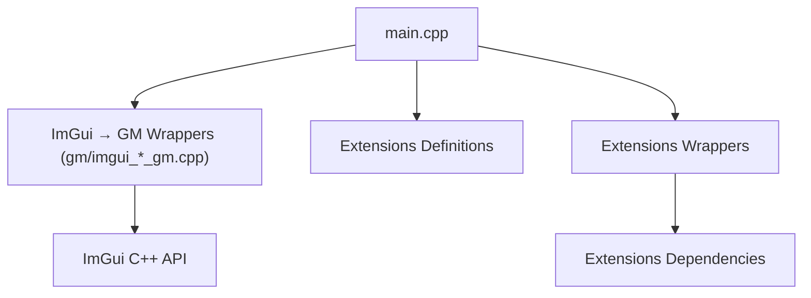

# DLL Layer

The DLL layer initializes rendering and IO for ImGui within GameMaker.
It contains C++ wrappers and extension definitions for extending functionality.

```mermaid
graph TD
    A[main.cpp] --> B["ImGui → GM Wrappers (gm/imgui_*_gm.cpp)"]
    B --> C[ImGui C++ API]
    A --> D[Extensions Definitions]
    A --> E[Extensions Wrappers]
    E --> F[Extensions Dependencies]
```
