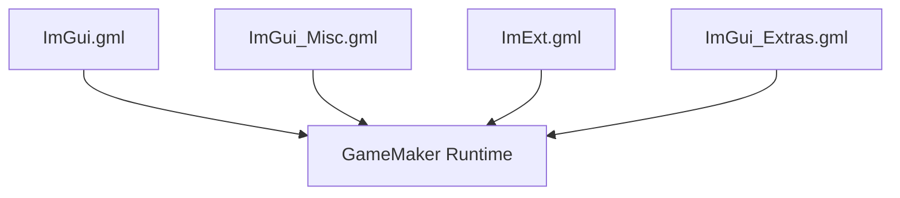

# GameMaker Layer

Scripts under gm/ expose ImGui components to GameMaker's runtime using static definitions and enums that map directly to the C++ bindings.

> This also applies for ImGui extensions (ImExts) that are included or you add yourself.

