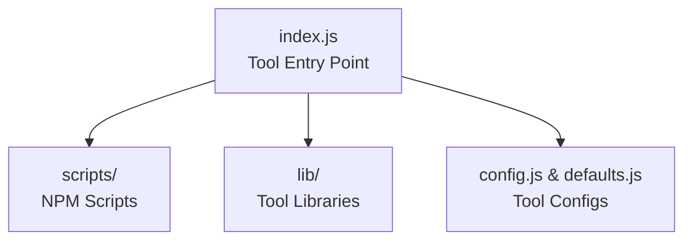

# Tooling Layer

The tooling layer houses utilities and scripts for managing extension wrappers, generating bindings, and configuring ImGM behavior.

```mermaid
graph TD
    G[index.js<br>Tool Entry Point] --> H[scripts/<br>NPM Scripts]
    G --> I[lib/<br>Tool Libraries]
    G --> J[config.js & defaults.js<br>Tool Configs]
```
